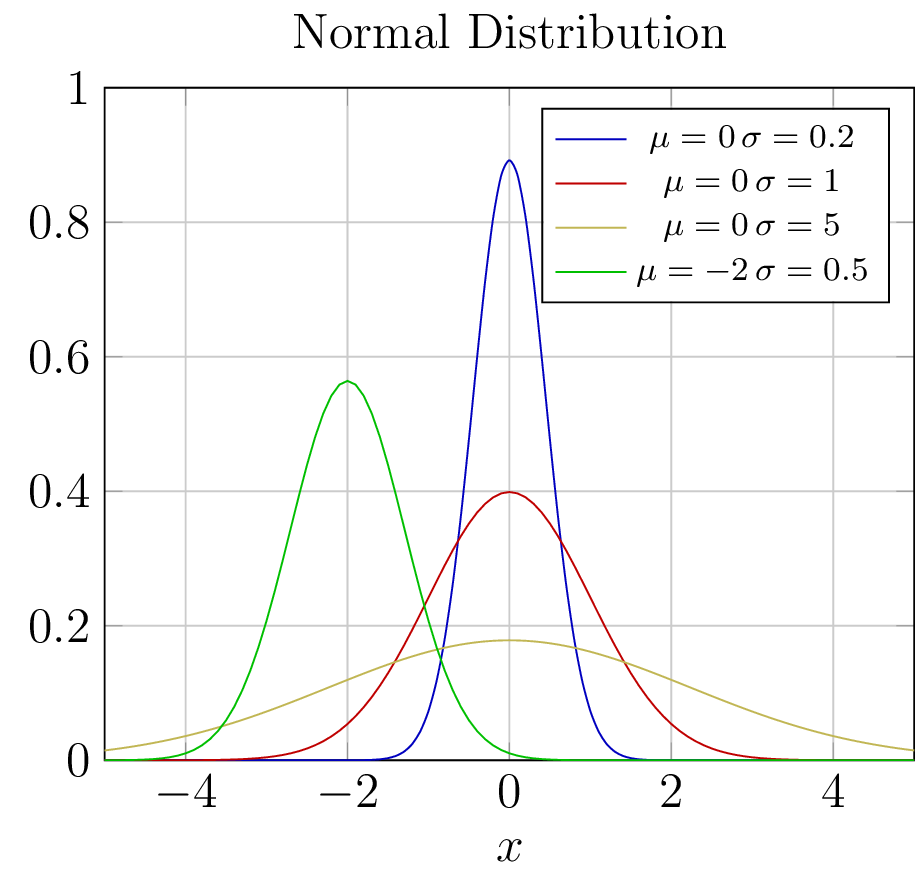
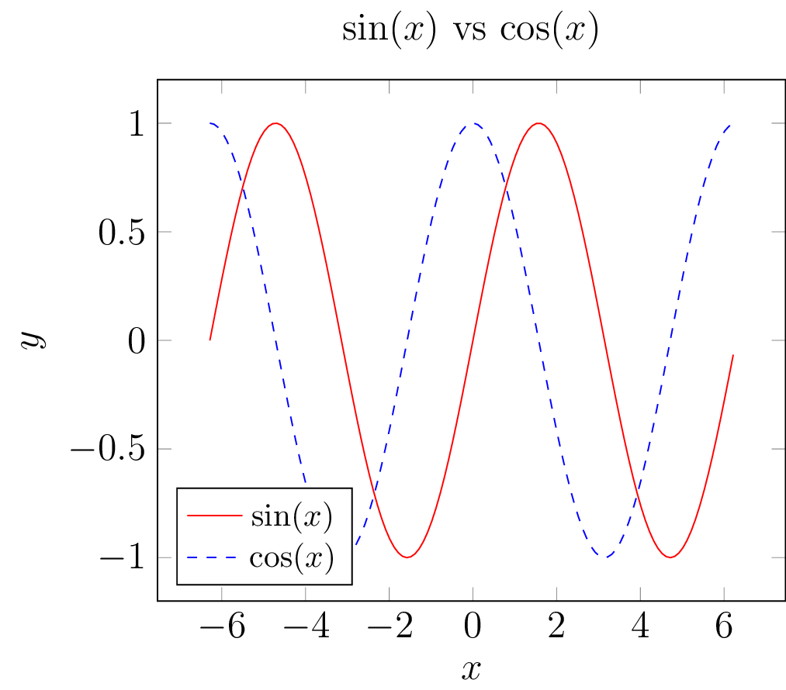
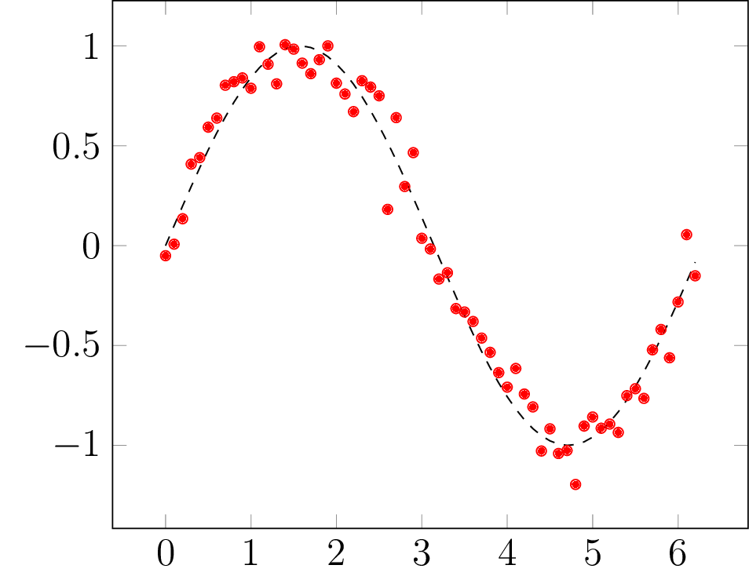

# ScalaTIKZ

[](https://maven-badges.herokuapp.com/maven-central/com.github.vagmcs/scalatikz_2.11)
[](https://www.gnu.org/licenses/gpl-3.0)

ScalaTIKZ is an open-source library for publication quality [PGF/TIKZ](https://en.wikipedia.org/wiki/PGF/TikZ) vector graphics using the [Scala programming language](http://scala-lang.org).

## License

ScalaTIKZ comes with ABSOLUTELY NO WARRANTY. This is free software, and you are welcome to redistribute it under certain conditions; See the [GNU Lesser General Public License v3 for more details](http://www.gnu.org/licenses/lgpl-3.0.html).

## Features

1. 2D PGF plots including lines, scatters, bars, stems and many other options.
2. Chart plots (pie, clouds, squares).
3. Configure each plot/chart using a large pool of parameters.
4. Plot any number of data sequences in one figure.
5. Support for figure arrays and figures having a secondary y-axis.
6. Support for Automata plots.
7. High level API for declaring plot types and subplots.
8. Save generated graphics as TeX, PDF, JPEG or PNG formats.
9. Command line interface that can be used in any Unix/Linux shell script.
10. Works on the [Almond](https://github.com/almond-sh/almond) kernel.

<table>
<tr>
    <td></td>
    <td></td>
    <td></td>
    <td></td>
</tr>
<tr>
    <td></td>
    <td></td>
    <td></td>
    <td></td>
</tr>
</table>

## Requirements

ScalaTIKZ requires to have a TeXLive distribution installed on your system.

For more details please read the [Requirements](docs/requirements.md).

## How to get ScalaTIKZ

ScalaTIKZ is published to Maven Central for Scala 2.12 and 2.13. 

Add the following dependency to your SBT build file in order to get started:

```scala
libraryDependencies ++= "com.github.vagmcs" %% "scalatikz" % "0.5.1"
```

In order to install ScalaTIKZ as a CLI tool, run:

```bash
curl https://raw.githubusercontent.com/vagmcs/ScalaTIKZ/master/install.sh | sh
```

## Documentation

- [PGFPlots, Charts and Automata](docs/index.md)

## Contributions

Contributions are welcome, for details see [CONTRIBUTING.md](CONTRIBUTING.md).