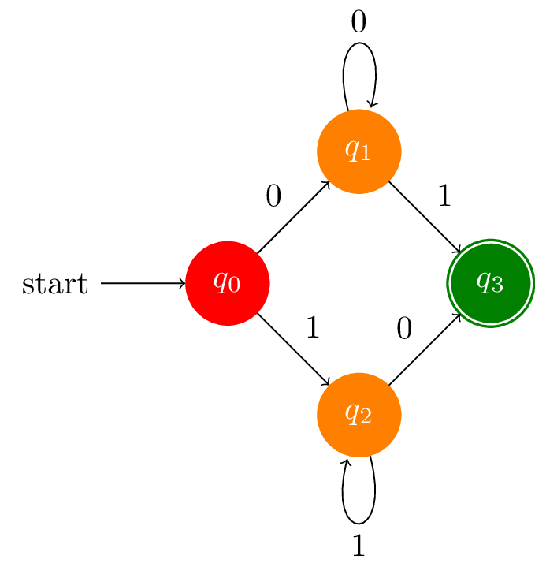
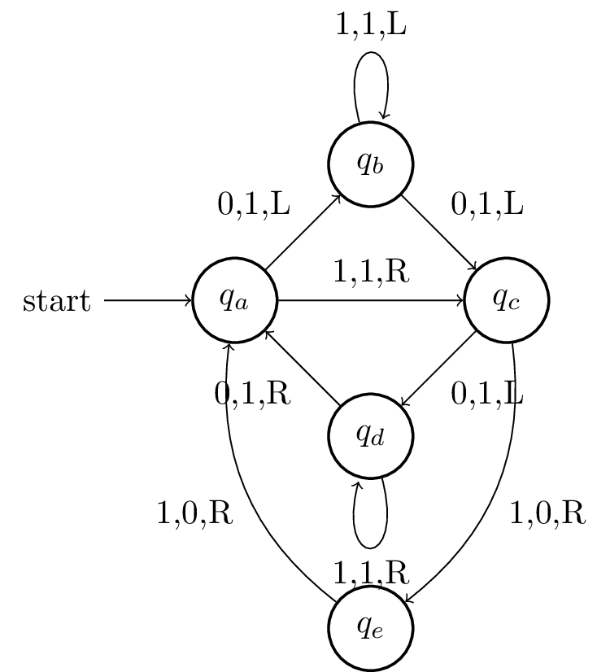

## Automata Examples

Lets create a simple automaton:

```scala
import scalatikz.pgf.automata.Automaton
import scalatikz.pgf.enums.Color._

Automaton("simple_automaton")
  .initialState(id = 0, name = "$q_0$")
  .state(id = 1, name = "$q_1$").aboveRightOf(0)
  .state(id = 2, name = "$q_2$").belowRightOf(0)
  .acceptingState(id = 3, name = "$q_3$").belowRightOf(1)
  .edge(0, 1, "0").straight
  .edge(1, 1, "0").loopAbove
  .edge(1, 3, "1").straight
  .edge(0, 2, "1").straight
  .edge(2, 2, "1").loopBelow
  .edge(2, 3, "0").straight
  .show()
```


Lets another light blue automaton:

```scala
import scalatikz.pgf.automata.Automaton
import scalatikz.pgf.enums.Color._

Automaton("light_blue_automaton")
  .initialState(drawColor = BLUE!50, fillColor = BLUE!20)(id = 0, name = "$q_0$")
  .state(drawColor = BLUE!50, fillColor = BLUE!20)(id = 1, name = "$q_1$").aboveRightOf(0)
  .state(drawColor = BLUE!50, fillColor = BLUE!20)(id = 2, name = "$q_2$").belowRightOf(0)
  .edge(0, 1, "0").straight
  .edge(1, 1, "0").loopAbove
  .edge(0, 2, "1").straight
  .edge(2, 2, "1").loopBelow
  .show()
```


Next lets create a colorful automaton:

```scala
import scalatikz.pgf.automata.Automaton
import scalatikz.pgf.enums.Color._

Automaton("colorful_automaton")
  .initialState(drawColor = RED, fillColor = RED, textColor = WHITE)(id = 0, name = "$q_0$")
  .state(drawColor = ORANGE, fillColor = ORANGE, textColor = WHITE)(id = 1, name = "$q_1$")
  .aboveRightOf(0)
  .state(drawColor = ORANGE, fillColor = ORANGE, textColor = WHITE)(id = 2, name = "$q_2$")
  .belowRightOf(0)
  .acceptingState(drawColor = GREEN!50!BLACK, fillColor = GREEN!50!BLACK, textColor = WHITE)(id = 3, name = "$q_3$")
  .belowRightOf(1)
  .edge(0, 1, "0").straight
  .edge(1, 1, "0").loopAbove
  .edge(1, 3, "1").straight
  .edge(0, 2, "1").straight
  .edge(2, 2, "1").loopBelow
  .edge(2, 3, "0").straight
  .show()
```



Finally, lets create a more complex automaton:

```scala
import scalatikz.pgf.automata.Automaton
import scalatikz.pgf.enums.Color._

Automaton("complex_automaton")
  .initialState(id = 0, name = "$q_a$")
  .state(id = 1, name = "$q_b$").aboveRightOf(0)
  .state(id = 2, name = "$q_c$").belowRightOf(1)
  .state(id = 3, name = "$q_d$").belowRightOf(0)
  .state(id = 4, name = "$q_e$").belowOf(3)
  .edge(0, 1, "0,1,L").straight
  .edge(0, 2, "1,1,R").straight
  .edge(1, 1, "1,1,L").loopAbove
  .edge(1, 2, "0,1,L").straight
  .edge(2, 3, "0,1,L").straight
  .edge(2, 4, "1,0,R").bendLeft
  .edge(3, 3, "1,1,R").loopBelow
  .edge(3, 0, "0,1,R").straight
  .edge(4, 0, "1,0,R").bendLeft
  .show()
```


