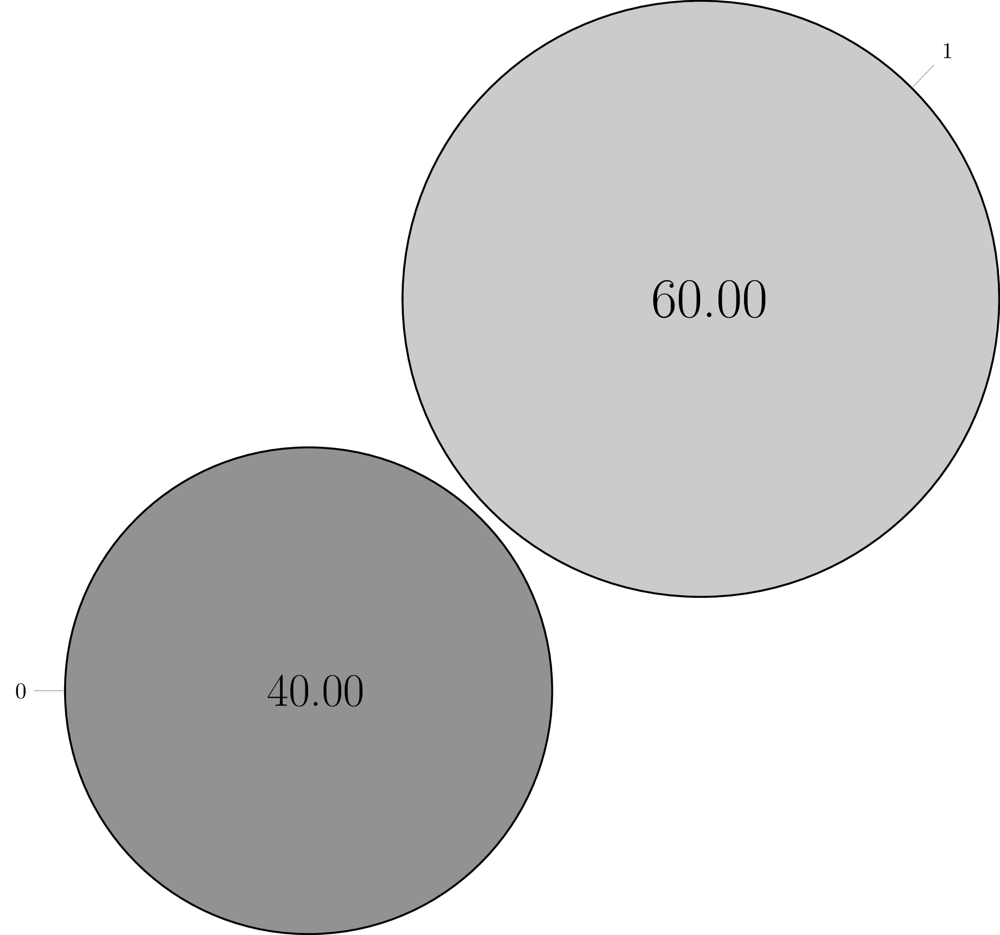

## Chart Examples

Lets create a simple chart:

```scala
import scalatikz.pgf.charts.Chart

Chart.pie("simple_pie", "A" -> 10, "B" -> 20, "C" -> 30, "D" -> 40)
  .havingRadius(4)
  .rotate(180)
  .show()
```


Lets see the default color wheel:

```scala
import scalatikz.pgf.charts.Chart

Chart.pie("color_wheel")(List(1, 2, 3, 4, 5, 6, 7, 8, 9, 10))
  .havingTextAfterNumber("\\%")
  .show()
```


Lets create a pie having only grayscale colors:

```scala
import scalatikz.pgf.charts.Chart
import scalatikz.pgf.enums.Color.BLACK

Chart.pie("grayscale_pie", "A" -> 10, "B" -> 20, "C" -> 30, "D" -> 40)
  .havingColors(BLACK!10, BLACK!20, BLACK!30, BLACK!40)
  .havingExplodeFactor(0.1)
  .show()
```


Lets create a pie having legends:

```scala
import scalatikz.pgf.charts.Chart
import scalatikz.pgf.charts.enums.TextLocation

Chart.pie("legends_pie", Map("First" -> 10, "Second" -> 20, "Third" -> 30, "Forth" -> 40))
  .havingText(TextLocation.LEGEND)
  .magnify
  .show()
```


Finally, lets create a random bit string and a cloud chart showing 0 and 1 frequencies.

```scala
import scalatikz.pgf.charts.Chart
import scalatikz.pgf.charts.enums.TextLocation
import scalatikz.pgf.enums.Color
import scala.util.Random

val randomBitString = (1 to 100) map (_ => Random.nextInt(2))

Chart.cloud("bit_frequency")(randomBitString)
  .havingText(TextLocation.PIN)
  .havingColors(Color.GRAY, Color.LIGHT_GRAY)
  .havingTextAfterNumber("//%")
  .magnify
  .show()
```


