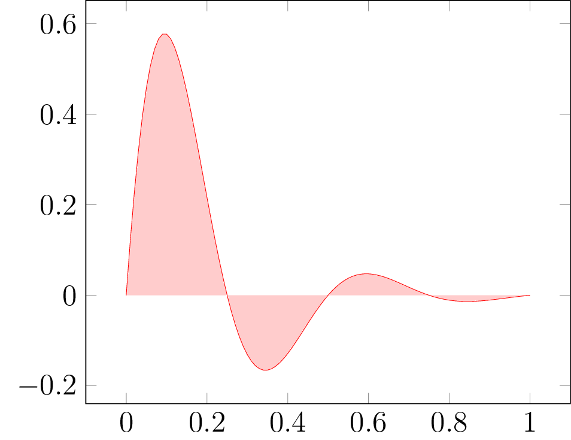
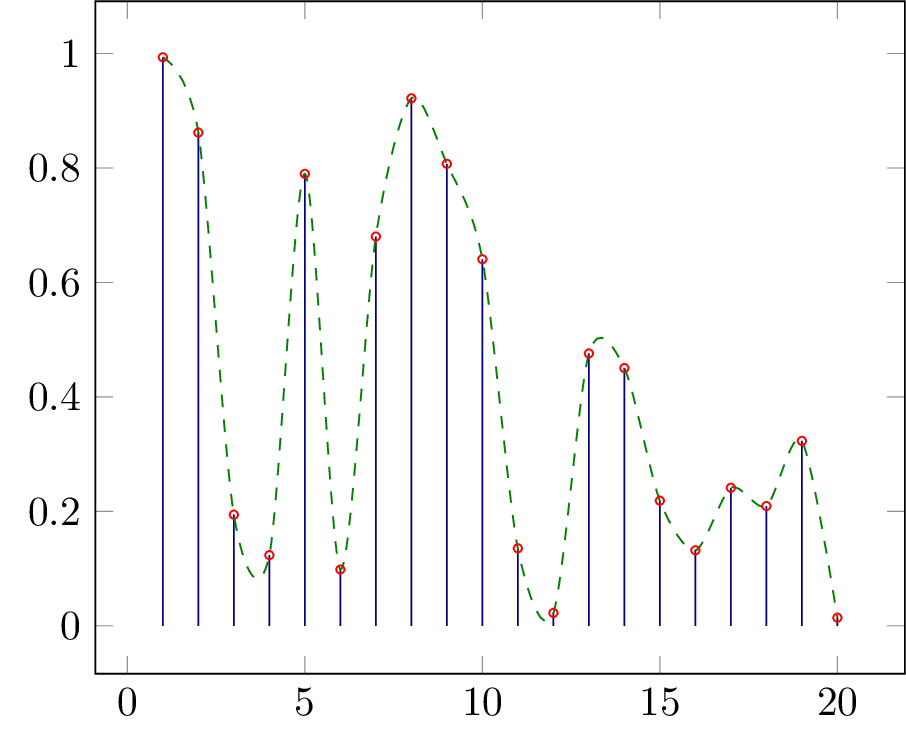
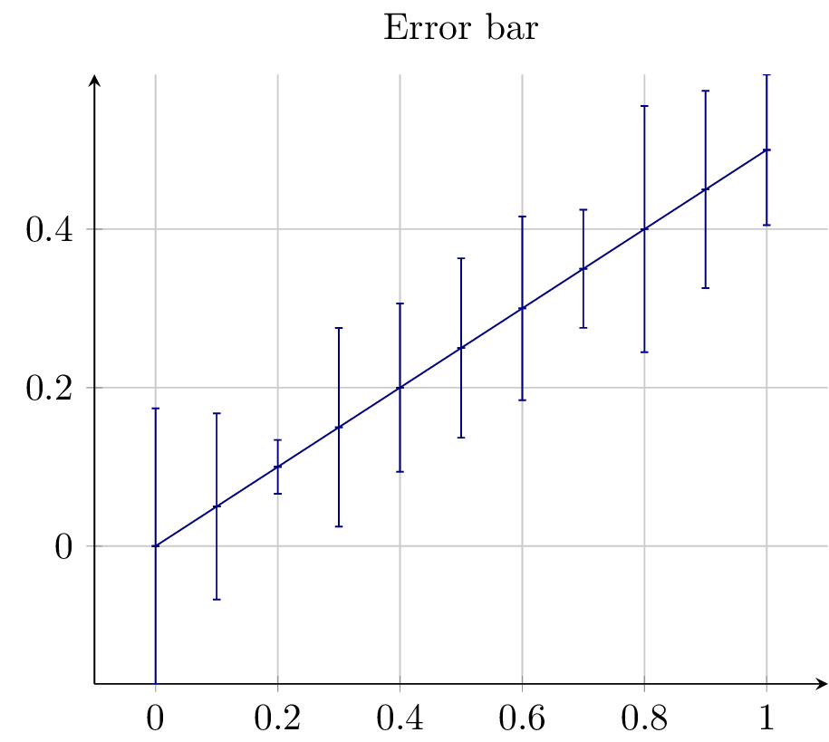

## PGF Plot Examples

Lets create a sine vs cosine plot:

```scala
import math._
import scalatikz.graphics.pgf.LineStyle._
import scalatikz.graphics.pgf.LegendPos._
import scalatikz.graphics.pgf.Figure

val domain = -2 * Pi to 2 * Pi by 0.1

Figure("sin_vs_cosine")
    .plot(domain -> sin _)
    .plot(lineStyle = DASHED)(domain -> cos _)
    .havingLegends("$\\sin(x)$", "$\\cos(x)$")
    .havingLegendPos(SOUTH_WEST)
    .havingXLabel("$X$")
    .havingYLabel("$Y$")
    .havingTitle("$\\sin(x)$ vs $\\cos(x)$")
    .show()
```
 


Lets create a plot of Gaussian distributions:

```scala
import math._
import scalatikz.graphics.pgf.Color._
import scalatikz.graphics.pgf.LegendPos._
import scalatikz.graphics.pgf.FontSize._
import scalatikz.graphics.pgf.Figure

def gaussian(mean: Double, variance: Double)(x: Double): Double =
    1 / sqrt(2 * Pi * variance) * exp( -pow(x - mean, 2) / (2 * variance))

val x = -5.0 to 5.0 by 0.1

Figure("gaussian")
    .plot(color = BLUE, smooth = true)(x -> gaussian(0, 0.2) _)
    .plot(color = RED)(x -> gaussian(0, 1) _)
    .plot(color = YELLOW!70!BLACK)(x -> gaussian(0, 5) _)
    .plot(color = GREEN)(x -> gaussian(-2, 0.5) _)
    .havingXLabel("$X$")
    .havingXLimits(-5, 5)
    .havingMajorGridOn
    .havingTitle("Normal Distribution")
    .havingLegends(
      "$\\mu=0\\, \\sigma=0.2$",
      "$\\mu=0\\, \\sigma=1$",
      "$\\mu=0\\, \\sigma=5$",
      "$\\mu=-2\\, \\sigma=0.5$"
    )
    .havingLegendPos(NORTH_EAST)
    .havingFontSize(FOOTNOTE)
    .show()
```


Lets plot an area:

```scala
import math._
import scalatikz.graphics.pgf.LineSize._
import scalatikz.graphics.pgf.Figure

val xx = 0.0 to 1.0 by 0.01

  Figure("area")
    .area(lineSize = VERY_THIN, opacity = 0.2) {
      xx -> ((x: Double) => sin(4 * Pi * x) * exp(-5 * x))
    }.show()
```



Lets plot a line and then plot a scatter of points along the line:

```scala
import math._
import scala.util.Random
import scalatikz.graphics.pgf.LineStyle._
import scalatikz.graphics.pgf.Color._
import scalatikz.graphics.pgf.Figure

val xs = 0.0 to 2 * Pi by 0.1

  Figure("spline")
    .plot(color = BLACK, lineStyle = DASHED)(xs -> sin _)
    .scatter(markFillColor = RED, markSize = 1.5) {
      xs -> ((x: Double) => sin(x) + 0.1 * Random.nextGaussian)
    }.saveAsPNG("images")
```


Lets plot a set of sinus functions and add some dark background to make the plot fancy:

```scala
import math._
import scala.util.Random
import scalatikz.graphics.pgf.Mark._
import scalatikz.graphics.pgf.Color._
import scalatikz.graphics.pgf.Figure

val xxs = 0.0 to 6.0 by 0.1

  val figure =
    Figure("dark")
      .havingBackgroundColor(BLACK!50)

  (1 to 6).foldLeft(figure) { case (fig, s) =>
    fig.plot(marker = DOT, markSize = 1.5)(xxs -> ((x: Double) => sin(x + s)))
  }.show()
```


Lets plot a stem function and a line passing through the stems:

```scala
import math._
import scala.util.Random
import scalatikz.graphics.pgf.Mark._
import scalatikz.graphics.pgf.LineStyle._
import scalatikz.graphics.pgf.Color._
import scalatikz.graphics.pgf.Figure

val randomPoints = (1 to 20).map(_ => Random.nextDouble)

  Figure("stem")
    .stem(color = BLUE!50!BLACK, marker = CIRCLE)(randomPoints)
    .plot(color = GREEN!50!BLACK, lineStyle = DASHED, smooth = true)(randomPoints)
    .show()
```



Lets plot a line having random error bars:

```scala
import math._
import scala.util.Random
import scalatikz.graphics.pgf.Mark._
import scalatikz.graphics.pgf.LineStyle._
import scalatikz.graphics.pgf.Color._
import scalatikz.graphics.pgf.AxisLinePos._
import scalatikz.graphics.pgf.Figure

  Figure("error_bar")
      .errorBar(BLUE!50!BLACK) {
        (0.0 to 1.0 by 0.1) -> ((x: Double) => x / 2)
      } {
        (1 to (0.0 to 1.0 by 0.1).length).map(_ => 0.0 -> scala.util.Random.nextDouble)
      }
      .havingTitle("Error bar")
      .havingXAxisLinePos(BOTTOM)
      .havingYAxisLinePos(LEFT)
      .havingMajorGridOn
      .havingXLimits(-0.1, 1.1)
      .show()
```



Finally, lets plot an array of plots:

```scala
import math._
import scala.util.Random
import scalatikz.graphics.pgf.Mark._
import scalatikz.graphics.pgf.LineStyle._
import scalatikz.graphics.pgf.Color._
import scalatikz.graphics.pgf.AxisLinePos._
import scalatikz.graphics.pgf.Figure

  Figure("array", 2, 2)
      .subFigure(0, 0) { x =>
        x.plot((0.01 to 10.0 by 0.1) -> log _)
          .havingXLabel("$x$")
          .havingYLabel("$\\log(x)$")
      }
      .subFigure(0, 1) { x =>
        x.plot(GREEN!40!BLACK)((-5.0 to 5.0 by 0.1) -> ((x: Double) => pow(x, 2)))
          .havingXLabel("$x$")
          .havingYLabel("$x^2$")
      }
      .subFigure(1, 0) { x =>
        x.plot(YELLOW!BLACK)((0.0 to 1.0 by 0.1) -> ((x: Double) => x))
          .havingXLabel("$x$")
          .havingYLabel("$y$")
      }
      .subFigure(1, 1) { x =>
        x.plot(BLUE)((-5.0 to 5.0 by 0.1) -> ((x: Double) => pow(x, 3)))
          .havingXLabel("$x$")
          .havingYLabel("$x^3$")
      }
      .show()
```

