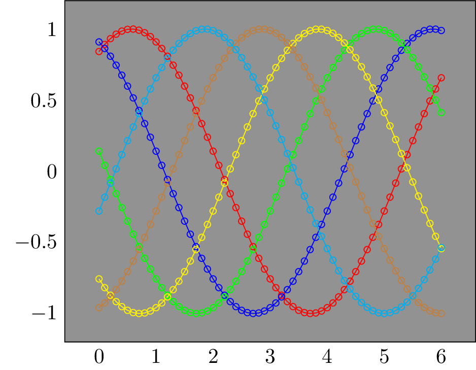
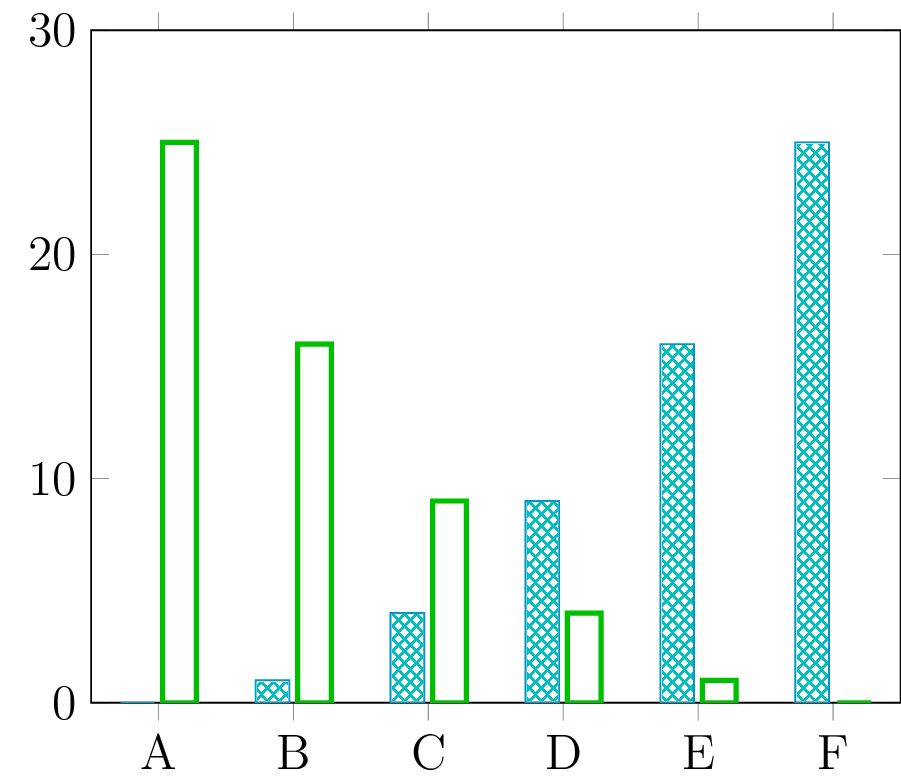

## PGF Plot Examples

Lets create a sine vs cosine plot:

```scala
import math._
import scalatikz.pgf.plots.Figure
import scalatikz.pgf.plots.enums.LegendPos.SOUTH_WEST
import scalatikz.pgf.plots.enums.LineStyle.DASHED

val domain = BigDecimal(-2 * Pi) to BigDecimal(2 * Pi) by 0.1

Figure("sin_vs_cosine")
  .plot(domain -> sin _)
  .plot(lineStyle = DASHED)(domain -> cos _)
  .havingLegends("$\\sin(x)$", "$\\cos(x)$")
  .havingLegendPos(SOUTH_WEST)
  .havingXLabel("$X$")
  .havingYLabel("$Y$")
  .havingTitle("$\\sin(x)$ vs $\\cos(x)$")
  .show()
```
 


Lets create a plot of Gaussian distributions:

```scala
import math._
import scalatikz.pgf.plots.Figure
import scalatikz.pgf.plots.enums.Color.{ BLACK, BLUE, GREEN, RED, YELLOW }
import scalatikz.pgf.plots.enums.FontSize.FOOTNOTE
import scalatikz.pgf.plots.enums.LegendPos.NORTH_EAST

def gaussian(mean: Double, variance: Double)(x: Double): Double =
    1 / sqrt(2 * Pi * variance) * exp( -pow(x - mean, 2) / (2 * variance))

val x = BigDecimal(-5) to BigDecimal(5) by 0.1

Figure("gaussian")
  .plot(lineColor = BLUE, smooth = true)(x -> gaussian(0, 0.2) _)
  .plot(lineColor = RED)(x -> gaussian(0, 1) _)
  .plot(lineColor = YELLOW!70!BLACK)(x -> gaussian(0, 5) _)
  .plot(lineColor = GREEN)(x -> gaussian(-2, 0.5) _)
  .havingXLabel("$X$")
  .havingXLimits(-5, 5)
  .havingMajorGridOn
  .havingTitle("Normal Distribution")
  .havingLegends(
    "$\\mu=0\\, \\sigma=0.2$",
    "$\\mu=0\\, \\sigma=1$",
    "$\\mu=0\\, \\sigma=5$",
    "$\\mu=-2\\, \\sigma=0.5$"
  )
  .havingLegendPos(NORTH_EAST)
  .havingFontSize(FOOTNOTE)
  .show()
```


Lets plot an area:

```scala
import math._
import scalatikz.pgf.plots.Figure
import scalatikz.pgf.plots.enums.LineSize.VERY_THIN

val xx = BigDecimal(0) to BigDecimal(1) by 0.01

Figure("area")
  .area(lineSize = VERY_THIN, opacity = 0.2) {
    xx -> ((x: Double) => sin(4 * Pi * x) * exp(-5 * x))
  }.show()
```


Lets plot a line and then plot a scatter of points along the line:

```scala
import math._
import scala.util.Random
import scalatikz.pgf.plots.Figure
import scalatikz.pgf.plots.enums.Color.{ BLACK, RED }
import scalatikz.pgf.plots.enums.LineStyle.DASHED

val xs = BigDecimal(0) to BigDecimal(2) * Pi by 0.1

Figure("spline")
  .plot(lineColor = BLACK, lineStyle = DASHED)(xs -> sin _)
  .scatter(markFillColor = RED, markSize = 1.5) {
    xs -> ((x: Double) => sin(x) + 0.1 * Random.nextGaussian)
  }.show()
```


Lets plot a set of sinus functions and add some dark background to make the plot fancy:

```scala
import math._
import scalatikz.pgf.plots.Figure
import scalatikz.pgf.plots.enums.Color.BLACK
import scalatikz.pgf.plots.enums.Mark.DOT

val xxs = BigDecimal(0) to BigDecimal(6) by 0.1

val figure = Figure("dark").havingBackgroundColor(BLACK!50)

(1 to 6).foldLeft(figure) { case (fig, s) =>
  fig.plot(marker = DOT, markSize = 1.5)(xxs -> ((x: Double) => sin(x + s)))
}.show()
```



Lets plot a stem function and a line passing through the stems:

```scala
import math._
import scala.util.Random
import scalatikz.pgf.plots.Figure
import scalatikz.pgf.plots.enums.Color.{ BLACK, BLUE, GREEN }
import scalatikz.pgf.plots.enums.LineStyle.DASHED
import scalatikz.pgf.plots.enums.Mark.CIRCLE

val randomPoints = (1 to 20).map(_ => Random.nextDouble)

Figure("stem")
  .stem(lineColor = BLUE!50!BLACK, marker = CIRCLE)(randomPoints)
  .plot(lineColor = GREEN!50!BLACK, lineStyle = DASHED, smooth = true)(randomPoints)
  .show()
```


Lets plot a line having random error bars:

```scala
import math._
import scala.util.Random
import scalatikz.pgf.plots.Figure
import scalatikz.pgf.plots.enums.AxisLinePos.{ BOTTOM, LEFT }
import scalatikz.pgf.plots.enums.Color.{ BLACK, BLUE }

Figure("error_bar")
  .errorBar(BLUE!50!BLACK) {
    (BigDecimal(0) to BigDecimal(1) by 0.1) -> ((x: Double) => x / 2)
  } {
    (1 to (BigDecimal(0) to BigDecimal(1) by 0.1).length).map(_ => 0.0 -> scala.util.Random.nextDouble)
  }
  .havingTitle("Error bar")
  .havingXAxisLinePos(BOTTOM)
  .havingYAxisLinePos(LEFT)
  .havingMajorGridOn
  .havingXLimits(-0.1, 1.1)
  .show()
```


Lets create a bar plot for the function `y = x^2`:

```scala
import math._
import scala.util.Random
import scalatikz.pgf.plots.Figure
import scalatikz.pgf.plots.enums.Color.{ WHITE, BLUE }

Figure("bar")
  .bar(barColor = BLUE!80!WHITE)((-20 to 20).map(x => (x, x * x)))
  .havingXLabel("$X$")
  .havingYLabel("$Y$")
  .show()
```



Lets create a mesh plot for the function `y = x + sin(x)`:

```scala
import math._
import scalatikz.pgf.plots.Figure
import scalatikz.pgf.plots.enums.ColorMap

val xc = BigDecimal(0) to BigDecimal(2) * Pi by 0.1

Figure("mesh")
  .mesh(xc -> ((x: Double) => x + math.sin(x)))
  .havingColorMap(ColorMap.COOL)
  .show()
```


Lets create a random scatter mesh:

```scala
import scala.util.Random
import scalatikz.pgf.plots.Figure
import scalatikz.pgf.plots.enums.ColorMap

Figure("scatter_mesh")
  .scatterMesh((0 to 100) -> ((x: Double) => x + Random.nextInt(10)))
  .havingColorMap(ColorMap.ViRiDiS)
  .show()
```


Next, lets plot an array of plots:

```scala
import math._
import scalatikz.pgf.plots.Figure
import scalatikz.pgf.plots.enums.Color.{ BLACK, BLUE, GREEN, YELLOW }

Figure("array", 2, 2)
  .subFigure(0, 0) { x =>
    x.plot((BigDecimal(0.01) to BigDecimal(10) by 0.1) -> log _)
      .havingXLabel("$x$")
      .havingYLabel("$\\log(x)$")
  }
  .subFigure(0, 1) { x =>
    x.plot(GREEN!40!BLACK)((BigDecimal(-5) to BigDecimal(5) by 0.1) -> ((x: Double) => pow(x, 2)))
      .havingXLabel("$x$")
      .havingYLabel("$x^2$")
  }
  .subFigure(1, 0) { x =>
    x.plot(YELLOW!BLACK)((BigDecimal(0) to BigDecimal(1) by 0.1) -> ((x: Double) => x))
      .havingXLabel("$x$")
      .havingYLabel("$y$")
  }
  .subFigure(1, 1) { x =>
    x.plot(BLUE)((BigDecimal(-5) to BigDecimal(5) by 0.1) -> ((x: Double) => pow(x, 3)))
      .havingXLabel("$x$")
      .havingYLabel("$x^3$")
  }
  .show()
```


Finally, lets plot a figure having two ordinates:

```scala
import scalatikz.pgf.plots.Figure
import scalatikz.pgf.plots.enums.Color.{ RED, BLUE }

Figure("secondary_axis")
  .plot(lineColor = RED)((-5 to 5) -> ((x: Double) => 3 * x))
  .havingXLabel("$x$")
  .havingYLabel("$3x$")
  .secondaryAxis { x => x
    .scatter(markStrokeColor = BLUE, markFillColor = BLUE)((-5 to 5) -> ((x: Double) => x * x))
    .havingYLabel("$x^2$")
  }
  .show()
```

